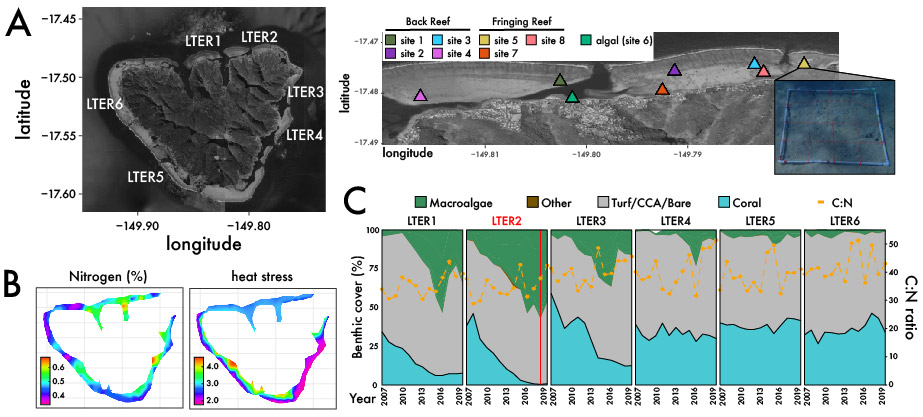

# mooreaMS

Relevant files for the analysis of the distribution of biosynthetic gene clusters (BGCs) in marine sediments collected from LTER2 in Moorea, French Polynesia

# Metabolomics Impacting Community Composition
To determine how microbial community structure and specialized metabolism are linked at local spatial scales, we employed a multi-omic approach to characterize the taxonomic composition, functional and biosynthetic potential, and community metabolomes within reef-associated sediments

  

## Metagenome Analysis
(meta)Genome Annotation: [PROKKA](https://github.com/tseemann/prokka)

(meta)Genome Assembler: [IDBA](https://github.com/loneknightpy/idba)

Phylogenetic Analysis: [RAxML](https://cme.h-its.org/exelixis/software.html)

## BGC Analysis
BGC Identification: [antiSMASH](https://antismash.secondarymetabolites.org)

BGC Clustering: [BiG-SCAPE](https://git.wageningenur.nl/medema-group/BiG-SCAPE)

